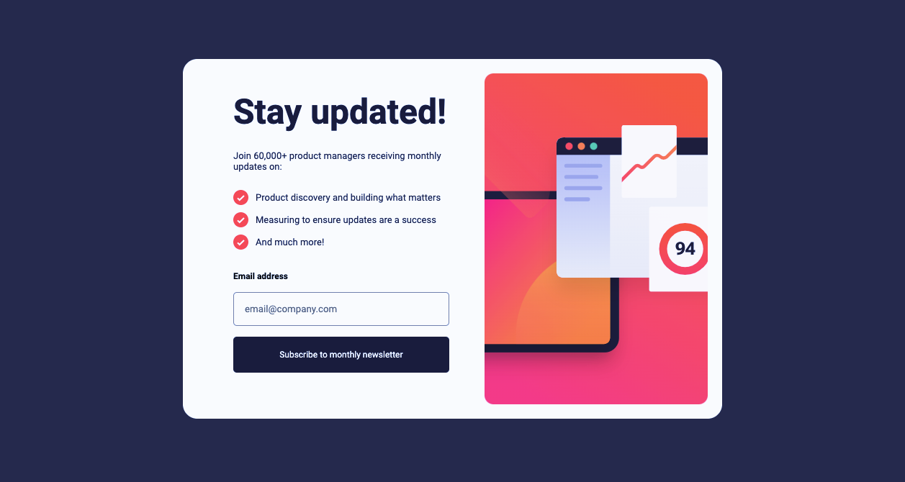
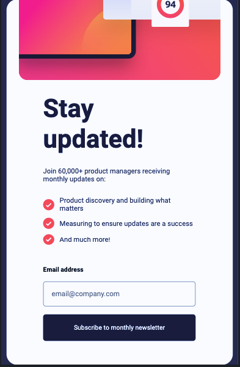

#Форма подписки на рассылку новостей с сообщением об успехе

## Привет! 👋

Что реализовано:

- Добавьте адрес электронной почты и отправьте форму.
- После успешной отправки формы вы увидите сообщение об успехе с адресом электронной почты.
  – См. сообщения проверки формы, если:
  - Поле осталось пустым
  - Адрес электронной почты имеет неправильный формат.
- Просмотр оптимального макета интерфейса в зависимости от размера экрана устройства.
- Просматривайте состояния наведения и фокуса для всех интерактивных элементов на странице.

Стэк:

- JavaScript
- SCSS
- @Media запросы

Скриншоты:

